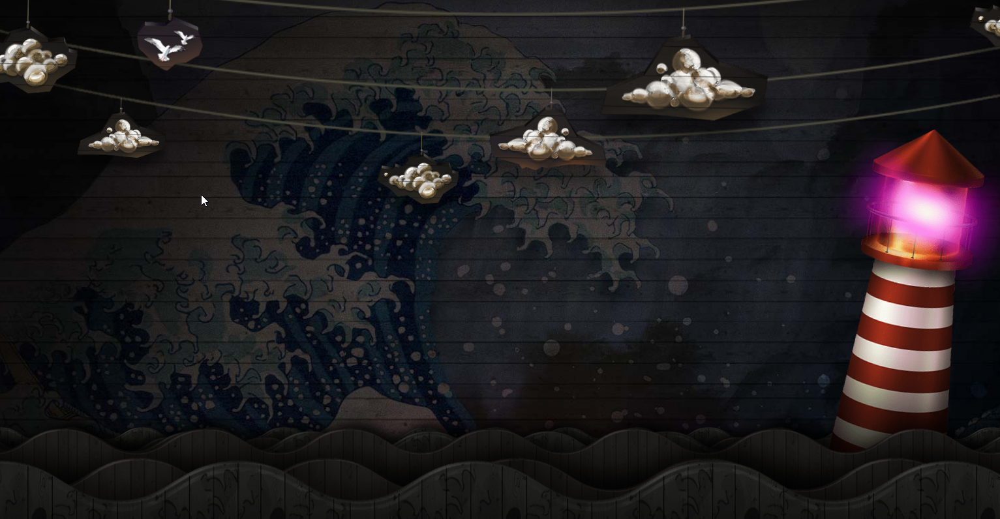

# Паралакс
На препроцессоре sass

## Море, маяк, облака. Шаблон
Для установки зависимостей проекта необходимо в командной строке ввести команды:
-	`npm install`

## Как запустить проект
В командной строке ввести `gulp`.

